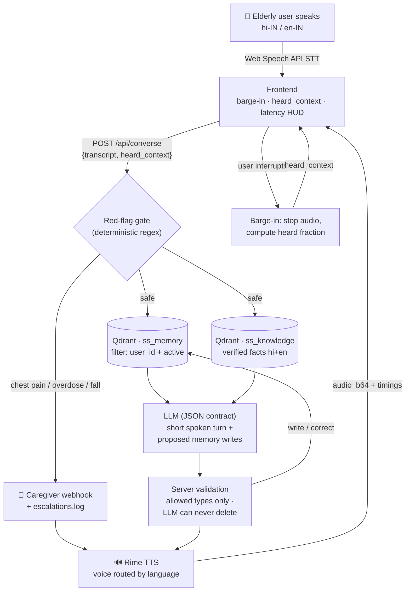

# Architecture — Sehat Saathi

## The four kinds of context (as the brief recommends)
1. **Knowledge** the agent may need → `ss_knowledge`
2. **Memories about this user** → `ss_memory` (schedule/preference)
3. **Similar past cases** → `ss_memory` (adherence history)
4. **Current task state** → `heard_context` + unresolved memories

## Why memory is trustworthy here
- Strict `user_id` payload filter on every recall (leak-proof by construction, tested).
- Corrections deactivate rather than overwrite (`active=false, superseded_by=…`) → audit trail.
- The Memory panel makes every stored item visible and deletable by the user.
